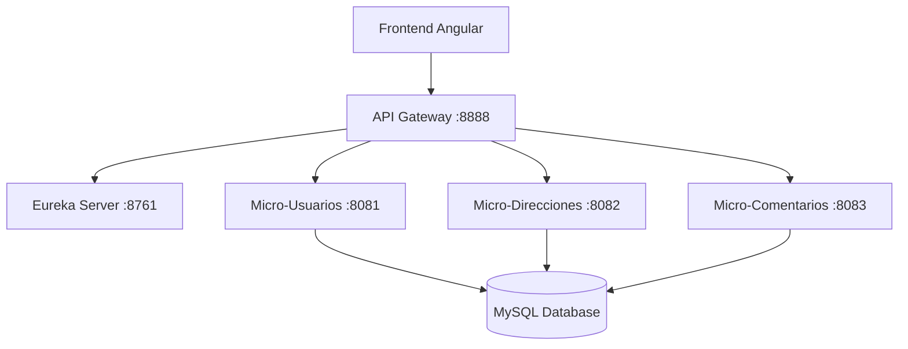

# 🏗️ Microservicios Spring Boot - Backend

Sistema de microservicios construido con Spring Boot, Spring Cloud y Eureka Server para gestión de usuarios, direcciones y comentarios con arquitectura distribuida.

## 🎯 Arquitectura de Microservicios



## 🚀 Servicios Incluidos

| Servicio | Puerto | Descripción | Endpoints |
|----------|--------|-------------|-----------|
| **API Gateway** | 8888 | Gateway central con CORS y routing | `/api/*` |
| **Eureka Server** | 8761 | Service Discovery y Registry | `/eureka` |
| **Micro-Usuarios** | 8081 | Gestión de usuarios | `/usuarios` |
| **Micro-Direcciones** | 8082 | Gestión de direcciones por usuario | `/direcciones` |
| **Micro-Comentarios** | 8083 | Gestión de comentarios por usuario | `/comentarios` |
| **MySQL Database** | 3306 | Base de datos relacional | - |

## 🛠️ Tecnologías Utilizadas

### Core Framework
- **Spring Boot** 3.x - Framework principal
- **Spring Cloud** 2023.x - Microservicios
- **Spring Data JPA** - Persistencia de datos
- **Spring Web** - APIs REST
- **Netflix Eureka** - Service Discovery

### Base de Datos
- **MySQL** 8.0 - Base de datos principal
- **H2 Database** - Testing (opcional)

### Infraestructura
- **Docker & Docker Compose** - Containerización
- **Maven** - Gestión de dependencias
- **Postman Collections** - Testing de APIs

## 📦 Instalación Rápida

### 🐳 Método Recomendado: Docker Compose

```bash
# Clonar el repositorio
git clone <repository-url>
cd udemy-apirest-micro

# Ejecutar todos los microservicios
docker-compose up -d

# Ver logs en tiempo real
docker-compose logs -f

# Verificar estado de servicios
docker-compose ps
```

### 🔧 Método Manual: Local Development

```bash
# Prerrequisitos
# - Java 17+
# - Maven 3.8+
# - MySQL 8.0

# 1. Clonar y configurar base de datos
git clone <repository-url>
cd udemy-apirest-micro
mysql -u root -p < init-db.sql

# 2. Compilar todos los servicios
./build-all.sh  # Linux/Mac
# O
build-all.bat   # Windows

# 3. Ejecutar servicios en orden
cd eureka-server && mvn spring-boot:run &
cd api-gateway && mvn spring-boot:run &
cd micro-usuarios && mvn spring-boot:run &
cd micro-direcciones && mvn spring-boot:run &
cd micro-comentarios && mvn spring-boot:run &
```

## 🌐 Endpoints de la API

### 👥 Usuarios (`/api/usuarios`)

```http
GET    /api/usuarios                    # Obtener todos los usuarios
POST   /api/usuarios                    # Crear nuevo usuario
GET    /api/usuarios/{id}               # Obtener usuario por ID
PUT    /api/usuarios/{id}               # Actualizar usuario
DELETE /api/usuarios/{id}               # Eliminar usuario
```

**Ejemplo Request:**
```json
POST /api/usuarios
{
  "nombre": "Juan Pérez",
  "email": "juan@ejemplo.com",
  "telefono": "+56912345678"
}
```

### 📍 Direcciones (`/api/direcciones`)

```http
GET    /api/direcciones/usuario/{usuarioId}    # Direcciones por usuario
POST   /api/direcciones                        # Crear dirección
GET    /api/direcciones/{id}                   # Obtener dirección por ID
PUT    /api/direcciones/{id}                   # Actualizar dirección
DELETE /api/direcciones/{id}                   # Eliminar dirección
GET    /api/direcciones/comuna/{comuna}        # Buscar por comuna
```

**Ejemplo Request:**
```json
POST /api/direcciones
{
  "calle": "Av. Libertador 1234",
  "ciudad": "Santiago",
  "comuna": "Las Condes",
  "codigoPostal": "7550000",
  "pais": "Chile",
  "usuarioId": 1
}
```

### 💬 Comentarios (`/api/comentarios`)

```http
GET    /api/comentarios/usuario/{usuarioId}    # Comentarios por usuario
POST   /api/comentarios                        # Crear comentario
GET    /api/comentarios/{id}                   # Obtener comentario por ID
PUT    /api/comentarios/{id}                   # Actualizar comentario
DELETE /api/comentarios/{id}                   # Eliminar comentario
```

**Ejemplo Request:**
```json
POST /api/comentarios
{
  "candidato": "Desarrollador Full Stack",
  "comentario": "Excelente manejo de tecnologías modernas",
  "usuarioId": 1
}
```

## 🗄️ Base de Datos

### Esquema de Tablas

```sql
-- Tabla usuarios
CREATE TABLE usuarios (
    id BIGINT AUTO_INCREMENT PRIMARY KEY,
    nombre VARCHAR(255) NOT NULL,
    email VARCHAR(255) UNIQUE NOT NULL,
    telefono VARCHAR(20)
);

-- Tabla direcciones  
CREATE TABLE direcciones (
    id BIGINT AUTO_INCREMENT PRIMARY KEY,
    calle VARCHAR(255) NOT NULL,
    ciudad VARCHAR(100) NOT NULL,
    comuna VARCHAR(100) NOT NULL,
    codigo_postal VARCHAR(20),
    pais VARCHAR(100) NOT NULL,
    usuario_id BIGINT,
    FOREIGN KEY (usuario_id) REFERENCES usuarios(id) ON DELETE CASCADE
);

-- Tabla comentarios
CREATE TABLE comentarios (
    id BIGINT AUTO_INCREMENT PRIMARY KEY,
    candidato VARCHAR(255) NOT NULL,
    comentario TEXT NOT NULL,
    usuario_id BIGINT,
    FOREIGN KEY (usuario_id) REFERENCES usuarios(id) ON DELETE CASCADE
);
```

### Datos de Ejemplo

```sql
-- Usuarios de prueba
INSERT INTO usuarios (nombre, email, telefono) VALUES
('Ana García', 'ana.garcia@email.com', '+56987654321'),
('Carlos López', 'carlos.lopez@email.com', '+56912345678'),
('María Silva', 'maria.silva@email.com', '+56998765432');

-- Direcciones asociadas
INSERT INTO direcciones (calle, ciudad, comuna, codigo_postal, pais, usuario_id) VALUES
('Av. Providencia 1234', 'Santiago', 'Providencia', '7500000', 'Chile', 1),
('Calle Los Leones 567', 'Santiago', 'Las Condes', '7550000', 'Chile', 2);

-- Comentarios asociados
INSERT INTO comentarios (candidato, comentario, usuario_id) VALUES
('Desarrollador Frontend', 'Excelente conocimiento en React y Angular', 1),
('Desarrollador Backend', 'Gran experiencia con Spring Boot y microservicios', 2);
```

## 🔧 Configuración

### Variables de Entorno

```bash
# Base de datos
DB_HOST=localhost
DB_PORT=3306
DB_NAME=microservicios_db
DB_USERNAME=micro_user
DB_PASSWORD=micro_password

# Puertos de servicios
EUREKA_PORT=8761
GATEWAY_PORT=8888
USUARIOS_PORT=8081
DIRECCIONES_PORT=8082
COMENTARIOS_PORT=8083
```

### Archivo `application.properties` Común

```properties
# Configuración de base de datos
spring.datasource.url=jdbc:mysql://${DB_HOST:localhost}:${DB_PORT:3306}/${DB_NAME:microservicios_db}
spring.datasource.username=${DB_USERNAME:micro_user}
spring.datasource.password=${DB_PASSWORD:micro_password}
spring.jpa.hibernate.ddl-auto=update
spring.jpa.show-sql=true

# Configuración de Eureka Client
eureka.client.service-url.defaultZone=http://localhost:8761/eureka/
eureka.instance.prefer-ip-address=true
```

## 🧪 Testing con Postman

### Colección Incluida
El proyecto incluye una colección completa de Postman:
- **Archivo:** `Microservicios-API-Collection.postman_collection.json`
- **Environment:** `Microservicios-Environment.postman_environment.json`

### Importar en Postman:
1. Abrir Postman
2. File → Import
3. Seleccionar ambos archivos JSON
4. Configurar environment con las URLs correctas

### Tests Incluidos:
- ✅ Crear usuario
- ✅ Listar usuarios  
- ✅ Crear dirección para usuario
- ✅ Crear comentario para usuario
- ✅ Eliminar registros
- ✅ Validaciones de errores

## 🐛 Solución de Problemas

### Servicios no se registran en Eureka
```bash
# Verificar que Eureka Server esté ejecutándose
curl http://localhost:8761/eureka/apps

# Revisar logs del servicio
docker logs <service-name>
```

### Error de conexión a base de datos
```bash
# Verificar MySQL
docker logs mysql-microservicios

# Verificar credenciales en application.properties
# Verificar que la base de datos exista
```

### Problemas de CORS
La configuración CORS ya está habilitada en el API Gateway. Si persisten problemas:
```java
// Verificar ApiGatewayConfig.java
@CrossOrigin(origins = "*", allowedHeaders = "*")
```

## 📊 Monitoreo

### Eureka Dashboard
- URL: http://localhost:8761
- Ver servicios registrados
- Estado de salud de microservicios

### Health Checks
```bash
# Gateway
curl http://localhost:8888/actuator/health

# Usuarios  
curl http://localhost:8081/actuator/health

# Direcciones
curl http://localhost:8082/actuator/health

# Comentarios
curl http://localhost:8083/actuator/health
```

## 🚀 Despliegue en Producción

### Docker Compose Producción
```bash
# Build y deploy
docker-compose up -d --build

# Escalar servicios
docker-compose up -d --scale micro-usuarios=3

# Logs de producción
docker-compose logs -f --tail=100
```

### Consideraciones de Producción
- ✅ Configurar SSL/TLS
- ✅ Variables de entorno para credenciales
- ✅ Health checks y monitoring
- ✅ Load balancing
- ✅ Backup de base de datos
- ✅ Logging centralizado

## 📋 Scripts de Utilidad

```bash
# Construir todos los servicios
./build-all.sh

# Limpiar y reconstruir
./clean-build.sh

# Inicializar base de datos
mysql -u root -p < init-db.sql

# Ver logs de todos los servicios
docker-compose logs -f
```

## 📄 Licencia

Este proyecto está bajo la Licencia MIT - ver el archivo [LICENSE.md](LICENSE.md) para detalles.

## 👥 Contribución

1. Fork del proyecto
2. Crear rama para feature (`git checkout -b feature/nueva-funcionalidad`)  
3. Commit de cambios (`git commit -am 'Agregar nueva funcionalidad'`)
4. Push a la rama (`git push origin feature/nueva-funcionalidad`)
5. Crear Pull Request

## 📞 Soporte

Para reportar bugs o solicitar nuevas características, crear un issue en GitHub.

---

**🏗️ Arquitectura de Microservicios con Spring Boot & Spring Cloud**